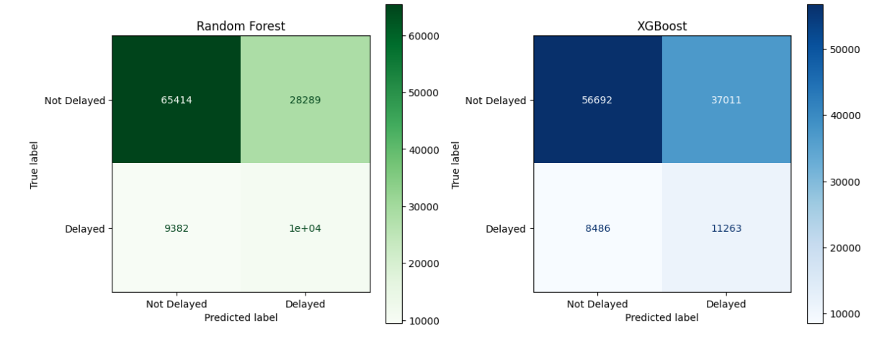
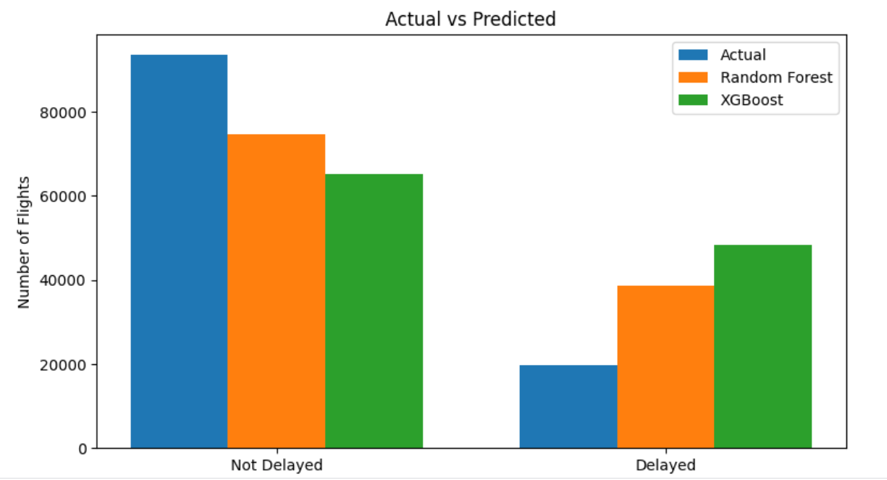
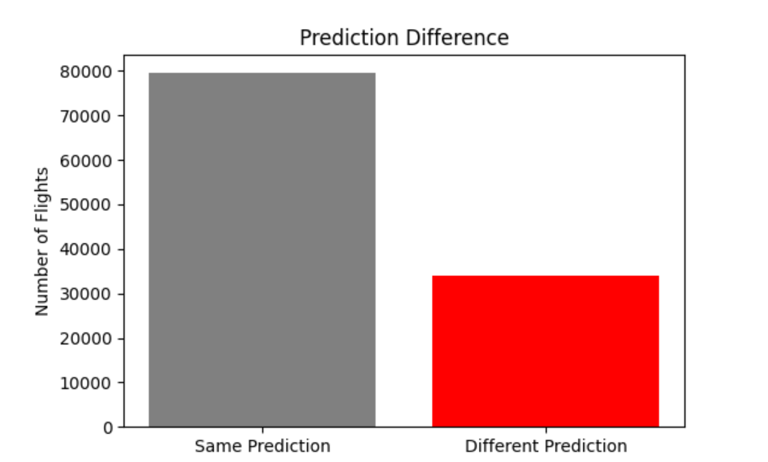

✈️ Flight Delay Prediction Using Machine Learning

Overview

This project predicts whether a flight will be delayed using historical flight data from January 2019.
The project focuses on building an end-to-end machine learning workflow, from raw data preparation to model evaluation.

The main learning from this project:

The success of a machine learning model depends heavily on how the data is cleaned, filtered, and prepared. Choosing a model is only one part of the process.

Project Objectives

The goal is to classify flights into two categories:

0 → Not Delayed
1 → Delayed

The project compares two machine learning classification models:

Random Forest Classifier
XGBoost Classifier
Dataset
The dataset contains flight information from January 2019.

Dataset source:

Kaggle - Plane Arrival Dataset (January 2019)
The dataset file is not included in this repository because of its size.

To run this project:

Download the dataset.
Place the CSV file inside the data folder.

Make sure the file name is:

Jan\_2019\_ontime.csv

Data Preparation:

A major part of this project was preparing the raw dataset before training models.

Steps performed:

Removed cancelled flights
Removed unnecessary identifier columns
Removed features that could cause data leakage
Handled missing values
Separated numerical and categorical features
Applied one-hot encoding to categorical variables
Managed class imbalance
Machine Learning Models
Random Forest
Used as a baseline model.

Configuration:

200 decision trees
Balanced class weights
Pipeline-based preprocessing
XGBoost
Used as a more advanced boosting model.

Configuration:

500 estimators
Learning rate: 0.05
Handled class imbalance using scale\_pos\_weight
Used early stopping
Workflow

The project workflow:

Raw Data
&#x20;   ↓
Data Cleaning
&#x20;   ↓
Feature Selection
&#x20;   ↓
Data Preprocessing
&#x20;   ↓
Model Training
&#x20;   ↓
Evaluation
&#x20;   ↓
Prediction Comparison

Models were evaluated using:

Accuracy score
Classification report
Confusion matrix
Prediction comparison charts

Visualizations include:

Random Forest vs XGBoost confusion matrices
Actual vs predicted flight counts
Difference between model predictions

Technologies Used:

Python
Pandas
NumPy
Matplotlib
Scikit-learn
XGBoost
Project Structure

ML project/

│

├── Flight\_Delay\_Prediction.py

├── README.md

├── requirements.txt

├── .gitignore

│

├── images/

│   ├── confusion\_matrix.png

│   ├── actual\_vs\_predicted.png

│   └── prediction\_difference.png

│

└── data/

&#x20;   └── Jan\_2019\_ontime.csv

Key Learnings

Through this project, I learned:

Real-world data requires extensive cleaning before modeling
Feature selection is important to avoid misleading predictions
Data preprocessing pipelines make machine learning workflows more reliable
Accuracy alone is not enough when dealing with imbalanced datasets
Visualization helps understand model behavior
Future Improvements

Possible improvements:

Add hyperparameter tuning
Try additional models such as LightGBM
Perform feature importance analysis
Deploy the model as a web application
Add cross-validation for better evaluation

## Results

### Confusion Matrix Comparison

### Actual vs Predicted Flights

### Prediction Difference

Author

Created as a machine learning practice project to understand the complete ML workflow from data preparation to model comparison.
